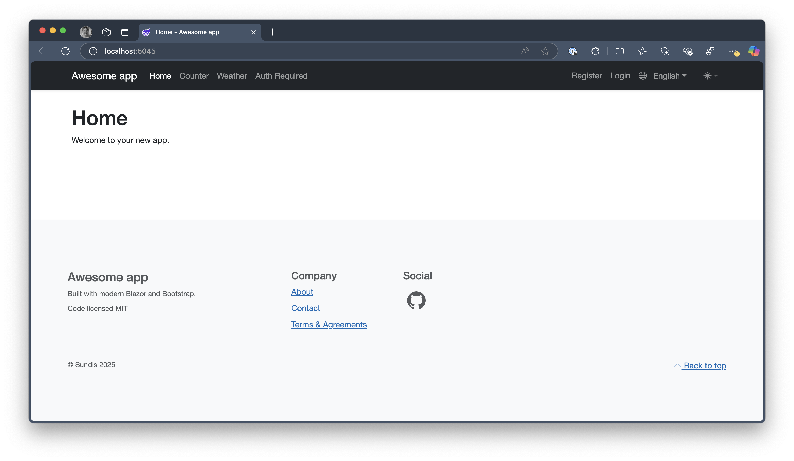
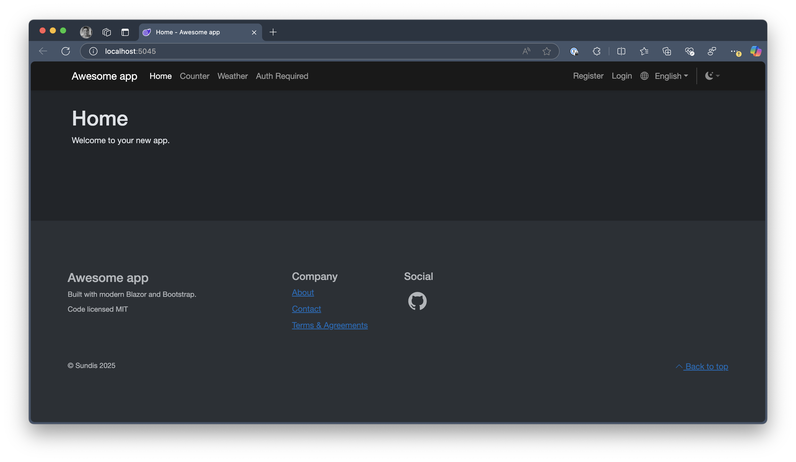
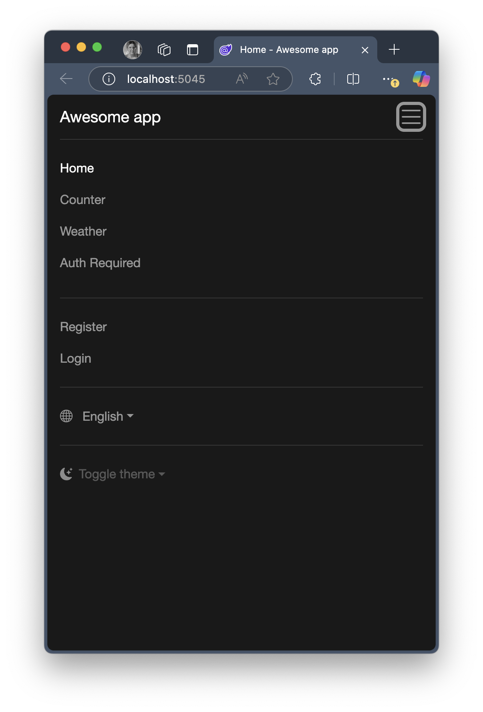

# Blazor Web App Starter

Enhanced starter project, generated from Blazor Web App, with updated layout and features based on Bootstrap 5.

## Features
Here are the enhancements made:

* Off canvas menu
* Localization
* Color schemes

Other features:

* ASP.NET Core Identity - standard from template, using SQLite.

## Screenshots



Light mode



Dark mode



Menu (mobile)

## ASP.NET Core Identity

Default database provider is Sqlite, but it can be easily changed. 

It's by default configured to require you to confirm your identity. But there is no such provider.

Of course, you can turn these requirements off.

To manually set the user as confirmed, use DB Browser for Sqlite:

```
EmailConfirmed = 1
LockoutEnabled = 0
```